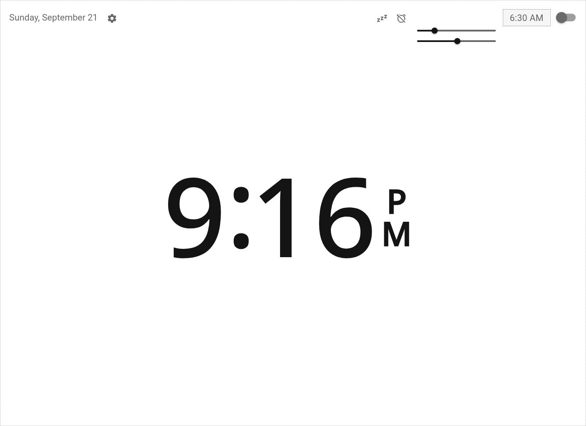

<br><br>
<div align="center">
    
</div>
<br><br>

# Kobold: A multi-alarm clock for Home Assistant

Install the Kobold custom card on your Home Assistant (HA) instance to turn almost any device running HA Companion or a web browser into a customizable alarm clock.

## Features:

- **Multi-alarm clock**
    - Set a schedule of alarm times, one for each day of the week
    - Set a new alarm at any time, temporarily overriding scheduled alarm
    - Set unscheduled alarm *X* minutes in future using **nap dialog**
    - Set alarm times easily using sliders directly on main view or in a dialog
- **Integrate with HA**
    - Set one or more HA entities to be triggered by alarm
    - Set one or more additional HA entities to activate *X* minutes before or after alarm
    - Add other HA cards to be displayed or hidden with a tap/click
- **Customize appearance and function**
    - Set 12-hour or 24-hour time display format
    - Set time display font to system or any of three presets
    - Set default durations of snooze and undismissed alarm
- **Enhance reliability**
    - Set HA entities to ping connection and to sound a LAN-accessible alarm

<br>

|||
| :---: | :---: |
| <figure><figcaption>**Main view: 24-hour format**</figcaption></figure> | <figure><figcaption>**Main view: 12-hour format, editing next alarm**</figcaption></figure> |
|||
| <figure><figcaption>**Settings dialog**</figcaption></figure> | <figure><figcaption>**Nap dialog**</figcaption></figure> |
|||
| <figure><figcaption>**Alarm schedule dialog: editing alarm**</figcaption></figure> | <figure><figcaption>**Main view: showing added HA cards, alternate font**</figcaption></figure> |
|||

<br>

## Prerequisites:

- [Home Assistant](https://www.home-assistant.io/installation/)
- [*Input boolean helper* integration](https://www.home-assistant.io/integrations/input_boolean/)
- [*HACS* integration](https://www.hacs.xyz/docs/use/download/prerequisites/)
- [*Variables+History* integration](https://github.com/enkama/hass-variables)

## Installation:

Copy the [latest release of `kobold-alarm-clock-card.js`](https://codeberg.org/entekadesign/kobold-alarm-clock/releases) to the `config` directory of your HA instance: 

```bash
<config>/www/kobold-alarm-clock/kobold-alarm-clock-card.js
```

## Configuration:

Register Kobold on the [resources page of your HA dashboard](https://developers.home-assistant.io/docs/frontend/custom-ui/registering-resources/) by adding the following as a javascript module:

```
/local/kobold-alarm-clock/kobold-alarm-clock-card.js
```

Add the following to your dashboard's [lovelace configuration](https://www.home-assistant.io/dashboards/dashboards/#using-yaml-for-the-overview-dashboard):

```yaml
- type: custom:kobold-alarm-clock
  alarm_entities:
    - input_boolean.alarm_clock
```

Kobold expects the entity ID of your input_boolean helper to be in the `alarm_entities` list. These are entity IDs representing HA integrations that will activate when the alarm is activated (called "alarm ringers" in the **settings dialog**). Note that the name portion of the entity IDs of the input_boolean helper and the Variables+History sensor must match. If each is not "alarm_clock," you must add a `name` entry to the lovelace configuration to set a new name:

```yaml
- type: custom:kobold-alarm-clock
  name: living_room_clock
  alarm_entities:
    - input_boolean.living_room_clock
```

## Usage:

Set an alarm for each day of the week in the **alarm schedule dialog**. The next alarm time will be displayed at the upper right corner of the main view. A toggle button indicates whether the next alarm is enabled. To override the scheduled alarm, tap/click on the next alarm display or enter a value in the **nap dialog**. A dotted border around next alarm time indicates that the scheduled alarm is overridden. To clear the override and return to the scheduled alarm, tap/click on the **CLEAR** button in the **nap dialog**.


## Optional configuration:

### Alarm actions

You can instruct Kobold to activate an HA integration at other times than when an alarm activates. For example, to configure an input_boolean helper to activate one minute before the alarm, add an `alarm_actions` entry to your lovelace configuration:  

```yaml
- type: custom:kobold-alarm-clock
  alarm_entities:
    - input_boolean.alarm_clock
  alarm_actions:
    - entity: input_boolean.alarm_clock_action
      when: '-00:01'
```

The value for `when` must be a string representing one of the following events: a time (in *HH:mm* format; positive values cause activation after the alarm), or a button activation ("on_snooze" for **Snooze** button, or "on_dismiss" for **Dismiss** button). Note that alarm actions are not executed for override alarms, only for scheduled alarms.

### Safety configuration

Enhance reliability by configuring both of the following.

1. The [*Ping* integration](https://www.home-assistant.io/integrations/ping/) provides a binary_sensor that can be used to query an IP address to confirm the availability of an Internet connection. If there is no connection, Kobold will display a warning when attempting a settings change, and it will try to use a LAN-accessible alarm (if one is configured). After installing the integration and configuring a binary_sensor to ping 8.8.8.8, for example, add the `ping_entity` entry to your lovelace configuration, including the binary_sensor entity ID as the value:

```yaml
- type: custom:kobold-alarm-clock
  alarm_entities:
    - input_boolean.alarm_clock
  ping_entity: binary_sensor.8_8_8_8
```

2. To configure a LAN-accessible alarm, add an `alarm_entity_local` entry to your lovelace configuration, including as the value the entity ID of an alarm integration that does not require the Internet:

```yaml
- type: custom:kobold-alarm-clock
  alarm_entities:
    - input_boolean.alarm_clock
  ping_entity: binary_sensor.8_8_8_8
  alarm_entity_local: input_boolean.alarm_clock_local
```

### Cards display

Display HA cards in an area along lower edge of main view by adding a `cards` entry to your lovelace configuration:

```yaml
- type: custom:kobold-alarm-clock
  alarm_entities:
    - input_boolean.alarm_clock
  cards:
    - type: weather-forecast
      name: NYC
      entity: weather.forecast_home
      show_forecast: true
      forecast_type: hourly
```

### Kiosk mode:

If you would like to eliminate the HA header and sidebar, first install a kiosk browser on your device, such as [*Kiosk+* for iOS](https://apps.apple.com/us/app/kiosk/id1239509744) or [*Fully-Kiosk Browser* for Android](https://www.fully-kiosk.com) or [*OpenKiosk* for all platforms](https://openkiosk.mozdevgroup.com/download.html). Then, install Thomas Lovén's excellent [*Browser_Mod* integration](https://github.com/thomasloven/hass-browser_mod) and configure it by registering the browser you installed and set it to remove header and sidebar. You can also configure *Browser_Mod* to automatically switch to the dashboard that contains Kobold.

### Browser audio

Another feature of *Browser_Mod* is its ability to allow a browser to serve an audio stream. Configuring HA to use your browser to sound alarms requires two elements: (1) an [HA *Template Switch*](https://www.home-assistant.io/integrations/switch.template/) and (2) an [HA *Script*](https://www.home-assistant.io/integrations/script/).

1. 

### Debug

Some debugging information can be logged in the HA system log by adding the following to your lovelace configuration:

```yaml
- type: custom:kobold-alarm-clock
  alarm_entities:
    - input_boolean.alarm_clock
  debug: true
```

## Development:

If you notice an error or have a feature suggestion that would benefit many users, [send me a note](mailto:marco@entekadesign.com) or [open a pull request](https://codeberg.org/entekadesign/kobold-alarm-clock/pulls).

If you want to build your own card but you're not sure how to start, [check out this tutorial](https://github.com/home-assistant-tutorials).

---

Kobold is adapted from Ronald Dehuysser's [Lovelace Alarm Clock Card](https://github.com/rdehuyss/homeassistant-lovelace-alarm-clock-card).