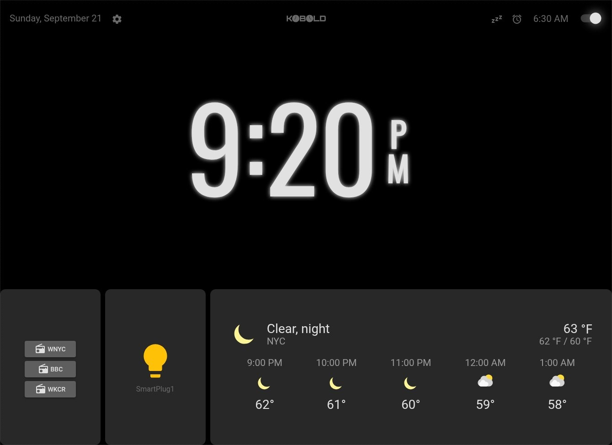

<br><br>
<div align="center">
    
</div>
<br><br>

# Kobold: A feature-rich alarm clock for Home Assistant

Turn almost any device running Home Assistant Companion or a web browser into a multi-alarm clock by installing the Kobold custom card on your Home Assistant (HA) instance.

## Features:

- **Multi-alarm clock**
    - Set a schedule of alarm times, one for each day of the week
    - Set an additional, unscheduled alarm time easily while scheduled alarm remains enabled
- **Integration with Home Assistant**   
    - Set one or more HA entities to be triggered by alarm
    - Set one or more additional HA entities to activate X minutes before or after alarm
    - Add other HA cards to be displayed or hidden with a tap
- **Customize appearance and function**
    - Set 12-hour or 24-hour time display format
    - Set time display font to system or any of three presets
    - Set duration of snooze (before alarm becomes active again)
    - Set duration of triggered alarm (before it becomes inactive)
- **Optional enhanced reliability**
    - Set HA entities to ping connection and to sound local alarm

<br>

| <figure><figcaption>Main view: 24-hour format</figcaption></figure> | <figure><figcaption>**Main view: alternate font, 12-hour format**</figcaption></figure> |
| :---: | :---: |
| <figure><figcaption>**Settings dialog**</figcaption></figure> | <figure><figcaption>**Nap dialog**</figcaption></figure> |
| <figure><figcaption>**Alarm schedule dialog: time editing**</figcaption></figure> | <figure><figcaption>**Main view: showing added HA cards**</figcaption></figure> |

<br>

## Requirements:

<br>

## Installation:

```yaml
type: custom:kobold-alarm-clock
```
<br>

## Development:

<br>

Kobold is adapted from Ronald Dehuysser's [Lovelace Alarm Clock Card](https://github.com/rdehuyss/homeassistant-lovelace-alarm-clock-card).